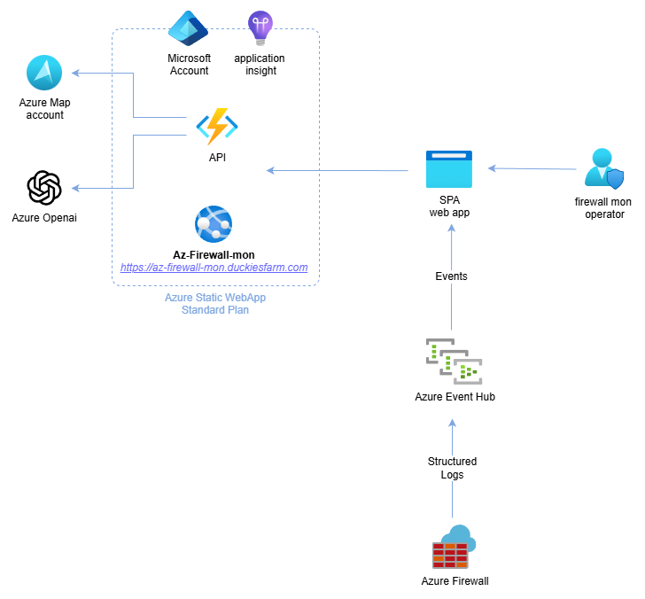

# Install az-firewall-mon in your environment

az-firewall-mon once installed in your environment will result in the following architecture:

The steps to follow to install a private copy of az-firewall-mon in your environment are:

* Fork the GitHub repository
* Create a GitHub Personal Access Token (PAT)
* Create all Azure resources
* Configure the GitHub Action to deploy both the SPA and the backend API
* Environment variables

# Fork the GitHub repository

The first thing to do is clone the az-firewall-mon repository. This will also allow you to pull down and build the latest changes and updates from the original repo while having the stability of maintaining your own personal copy.

* Navigate to: <https://github.com/nicolgit/azure-firewall-mon>.
* Click Fork > create a new fork (top right of the repository)
* Click [Create fork]

> You have now a fork of the 'az-firewall-mon' repository; when a new update comes out - you can also select 'Sync fork' - to keep your fork up-to-date and trigger a new build.

# Create a GitHub Personal Access Token (PAT)

1. Go to your GitHub account settings
2. Select **Developer settings** > **Personal access tokens** > **Tokens (classic)** (<https://github.com/settings/tokens>)
3. Click **Generate new token** > **Generate new token (classic)**
4. Give your token a name like "Azure Static Web App Deployment"
5. Expiration: `No Expiration`
6. Select the following scopes:
   - `repo` (Full control of private repositories)
   - `workflow` (Update GitHub Action workflows)
7. Click **Generate token**
8. **Copy your token** (you won't be able to see it again)

# Create all Azure resources
An instance of `az-firewall-mon` is composed of:
* 1 Azure Static Web App (standard plan)
* 1 Azure Maps account
* 1 Azure OpenAI account
* 1 Application Insights instance

All these resources can be deployed to your subscription by clicking the button below:

Remember to fill in the following parameters:
   - `staticWebAppName`: Name for your static web app
   - `repositoryUrl`: Your GitHub repository URL (e.g., `https://github.com/username/azure-firewall-mon`)
   - `repositoryToken`: Your GitHub PAT created in the above paragraph
   - `branch`: Your main branch ('main')

This will create an action in your repository that will build and deploy the solution to Azure.

Go to <https://github.com/YOURGITHUBACCOUNT/azure-firewall-mon/actions> to see the deployment status. When deployment is complete, go to Azure Portal > Static Web Apps > View app in browser

# Environment variables 

az-firewall-mon requires a few environment variables to work. These variables are configured automatically by the deployment. Here's the reference in case you want to change any:

 APPLICATIONINSIGHTS_CONNECTION_STRING: Application Insights connection string 
    
Azure Maps settings
* **ip_api_key**: Azure Maps API key
* **ip_throttling_calls**: '1'
* **ip_throttling_window_milliseconds**: '1000'

IP API will return a 429 status code if you make more than 1 call to IP API per second (1000 milliseconds)

Azure OpenAI settings
* **aoai_api_key**: Azure OpenAI key
* **aoai_endpoint**: Azure OpenAI endpoint
* **aoai_deployment**: Azure OpenAI deployment name

* **llm_throttling_calls**: '5'
* **llm_throttling_window_milliseconds**: '60000'
Chat API will return a 429 status code if you make more than 5 calls per minute (60000 milliseconds)
